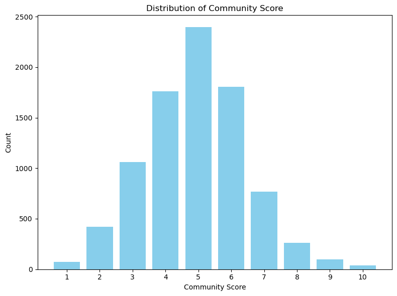

```python
import pandas as pd
import numpy as np
import matplotlib.pyplot as plt

###################################################### COMMUNITY RATING ####################################################################################

filepath = '/Users/justineleaclement/Documents/Projets /Australia_SubProjet/merged_inner_df.csv'
merged_df = pd.read_csv(filepath)

merged_df = merged_df.drop('__url_x', axis=1)
merged_df.head()
```


<div>
<style scoped>
    .dataframe tbody tr th:only-of-type {
        vertical-align: middle;
    }

    .dataframe tbody tr th {
        vertical-align: top;
    }

    .dataframe thead th {
        text-align: right;
    }
</style>
<table border="1" class="dataframe">
  <thead>
    <tr style="text-align: right;">
      <th></th>
      <th>suburb_name</th>
      <th>_google_import_B</th>
      <th>suburb_population</th>
      <th>suburb_median_age</th>
      <th>suburb_number_of_families</th>
      <th>suburb_number_of_private_dwellings</th>
      <th>suburb_number_of_people_per_household</th>
      <th>suburb_financial_median_monthly_mortgage_repayments</th>
      <th>suburb_financial_median_weekly_household_income</th>
      <th>suburb_transport_average_car_per_dwelling</th>
      <th>...</th>
      <th>violent_crimes_per_1000_people</th>
      <th>percentage_suburbs_with_less_violet_crimes</th>
      <th>percentage_suburbs_with_less_property_crimes</th>
      <th>top_crime_types</th>
      <th>changes_of_being_a_victim_of_a_violent_crime_in_suburb</th>
      <th>chances_of_being_a_victim_of_violent_crime_in_state</th>
      <th>chances_of_being_a_violent_victim_in_australia</th>
      <th>chances_of_being_a_property_victim_in_suburb</th>
      <th>chances_of_being_a_property_victim_in_state</th>
      <th>chances_of_being_a_property_victim_in_australia</th>
    </tr>
  </thead>
  <tbody>
    <tr>
      <th>0</th>
      <td>Adaminaby</td>
      <td>https://abs.gov.au/census/find-census-data/qui...</td>
      <td>339</td>
      <td>52.0</td>
      <td>74</td>
      <td>224</td>
      <td>2.0</td>
      <td>$1,083</td>
      <td>$954</td>
      <td>2.2</td>
      <td>...</td>
      <td>14.75</td>
      <td>88.05%</td>
      <td>53.67%</td>
      <td>Top crime types: Justice procedures offences I...</td>
      <td>1 in 68</td>
      <td>1 in 97</td>
      <td>1 in 105</td>
      <td>1 in 85</td>
      <td>1 in 44</td>
      <td>1 in 31</td>
    </tr>
    <tr>
      <th>1</th>
      <td>Albury</td>
      <td>https://abs.gov.au/census/find-census-data/qui...</td>
      <td>4,955</td>
      <td>45.0</td>
      <td>1,236</td>
      <td>2,630</td>
      <td>2.0</td>
      <td>$1,733</td>
      <td>$1,601</td>
      <td>1.5</td>
      <td>...</td>
      <td>63.98</td>
      <td>98.03%</td>
      <td>97.47%</td>
      <td>Top crime types: Theft In 2022 in Albury there...</td>
      <td>1 in 16</td>
      <td>1 in 97</td>
      <td>1 in 105</td>
      <td>1 in 6</td>
      <td>1 in 44</td>
      <td>1 in 31</td>
    </tr>
    <tr>
      <th>2</th>
      <td>Alectown</td>
      <td>https://abs.gov.au/census/find-census-data/qui...</td>
      <td>151</td>
      <td>49.0</td>
      <td>43</td>
      <td>67</td>
      <td>2.4</td>
      <td>$1,257</td>
      <td>$1,803</td>
      <td>2.2</td>
      <td>...</td>
      <td>19.87</td>
      <td>91.63%</td>
      <td>67.51%</td>
      <td>Top crime types: Assault and related offences ...</td>
      <td>1 in 50</td>
      <td>1 in 97</td>
      <td>1 in 105</td>
      <td>1 in 50</td>
      <td>1 in 44</td>
      <td>1 in 31</td>
    </tr>
    <tr>
      <th>3</th>
      <td>Alpine</td>
      <td>https://abs.gov.au/census/find-census-data/qui...</td>
      <td>141</td>
      <td>49.0</td>
      <td>42</td>
      <td>61</td>
      <td>2.8</td>
      <td>$3,033</td>
      <td>$2,291</td>
      <td>3.3</td>
      <td>...</td>
      <td>0.00</td>
      <td>0%</td>
      <td>69.5%</td>
      <td>Top crime types: Theft In 2022 in Alpine there...</td>
      <td>1 in INF</td>
      <td>1 in 97</td>
      <td>1 in 105</td>
      <td>1 in 47</td>
      <td>1 in 44</td>
      <td>1 in 31</td>
    </tr>
    <tr>
      <th>4</th>
      <td>Argoon</td>
      <td>https://abs.gov.au/census/find-census-data/qui...</td>
      <td>NaN</td>
      <td>NaN</td>
      <td>NaN</td>
      <td>NaN</td>
      <td>NaN</td>
      <td>NaN</td>
      <td>NaN</td>
      <td>NaN</td>
      <td>...</td>
      <td>0.00</td>
      <td>0%</td>
      <td>0%</td>
      <td>Top crime types:</td>
      <td>1 in INF</td>
      <td>1 in 97</td>
      <td>1 in 105</td>
      <td>1 in INF</td>
      <td>1 in 44</td>
      <td>1 in 31</td>
    </tr>
  </tbody>
</table>
<p>5 rows × 251 columns</p>
</div>


```python
# Columns related to Community features
community_columns = [
    'suburb_community_volunteerism_percentage',
    'suburb_community_long_term_residents'
]

# Converting columns to numeric and remove the '%' symbol
merged_df[community_columns] = merged_df[community_columns].replace('%', '', regex=True)
merged_df[community_columns] = merged_df[community_columns].apply(pd.to_numeric, errors='coerce')

# Calculating ranks for each column
for col in community_columns:
    merged_df[col + '_rank'] = merged_df[col].rank(method='dense')

# Adding a function to scale values to a 1-10 range
def scale_to_1_to_10(value):
    min_val = value.min()
    max_val = value.max()
    return ((value - min_val) / (max_val - min_val)) * 9 + 1

# Applying the scaling function to each column
for col in community_columns:
    merged_df[col + '_Mapped_Score'] = scale_to_1_to_10(merged_df[col + '_rank'])

# Calculating the overall average score across the columns
merged_df['Community_Score'] = round(merged_df[[col + '_Mapped_Score' for col in community_columns]].mean(axis=1))

print("Overall Community Score:", merged_df['Community_Score'])

# See the count of each score
community_score_counts = merged_df['Community_Score'].value_counts()
print('********** Overall Community Score Counts **********', community_score_counts)
```

    Overall Community Score: 0        5.0
    1        6.0
    2        8.0
    3        7.0
    4        NaN
            ... 
    15314    5.0
    15315    1.0
    15316    2.0
    15317    1.0
    15318    7.0
    Name: Community_Score, Length: 15319, dtype: float64
    ********** Overall Community Score Counts ********** 5.0     2394
    6.0     1804
    4.0     1759
    3.0     1059
    7.0      767
    2.0      419
    8.0      261
    9.0       97
    1.0       75
    10.0      37
    Name: Community_Score, dtype: int64


```python
value_counts = merged_df['Community_Score'].value_counts()
sorted_value_counts = value_counts.sort_index()

# Bar plot for 'Community_Score' distribution
plt.figure(figsize=(8, 6))
plt.bar(sorted_value_counts.index, sorted_value_counts.values, color='skyblue')
plt.xlabel('Community Score')
plt.ylabel('Count')
plt.title('Distribution of Community Score')
plt.xticks(sorted_value_counts.index)
plt.tight_layout()
plt.show()
```


    

    

